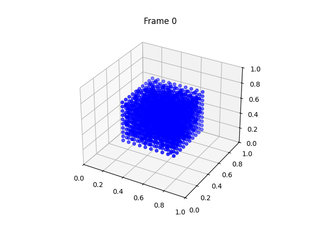

# A PyTorch Implementation of MLS-MPM (Moving Least Squares Material Point Method)
This repository provides a PyTorch implementation of the MLS-MPM (Moving Least Squares Material Point Method). The algorithm is implemented using **a few lines of tensor operations in PyTorch**, making it naturally differentiable and optimized for GPU acceleration. 
The code is vectorized without any explicit loops, which makes it efficient for large-scale simulations. 

[Gradient Checkpointing](https://pytorch.org/docs/stable/checkpoint.html) is highly recommended when integrating the MLS-MPM into a trainable deep learning framework. See [OmniPhysGS](https://github.com/wgsxm/omniphysgs) (ICLR 2025) for an example. 
## Installation
### From source
```bash
git clone https://github.com/wgsxm/MPM-PyTorch.git
cd MPM-PyTorch
pip install .
```
## Quick Start
Run the following code to try a simple example of MLS-MPM simulation. The code simulates a 3D elastic jelly falling onto a rigid floor. By default, the code will produce a video of the simulation in the `output` directory.
```bash
python simulate.py --config examples/jelly.yaml
```
 
 

## Usage
Refer to `simulate.py` for more details. 
```python
from mpm_pytorch import MPMSolver, set_boundary_conditions
from mpm_pytorch.constitutive_models import *
particles = ... # Particle positions to simulate
# Create a MPM solver with default parameters
mpm_solver = MPMSolver(particles)
# Set boundary conditions (optional)
boundary_conditions = ... # Refer to example configs
set_boundary_conditions(mpm_solver, boundary_conditions)
# Create constitutive models
elasticity = CorotatedElasticity(E=2e6)
plasicity = IdentityPlasticity()
# Init particle state
x = particles
v = torch.zeros_like(x)
C = torch.zeros((x.shape[0], 3, 3), device=x.device)
F = torch.eye(3, device=x.device).unsqueeze(0).repeat(x.shape[0], 1, 1)
# Start simulation for T steps
for i in range(T):
    # Update stress
    stress = elasticity(F)
    # Particle to grid, grid update, grid to particle
    grid_update = mpm_solver(x, v, C, F, stress)
    # Plasticity correction
    F = plasticity(F)
```

## Fast Batched SVD
Batched SVD is a common operation in constitutive models. Original PyTorch SVD is not optimized for batched computation. We adopt a `warp-lang` implementation of differentiable batched SVD in `mpm_pytorch.constitutive_models.warp_svd` from [NCLaw](https://github.com/PingchuanMa/NCLaw/tree/main/nclaw/warp). It can run on CPU or GPU with CUDA. 

The result of the decomposed matrices is not guaranteed to be the same as the original PyTorch SVD. You can also use the original PyTorch SVD or other batched SVD implementations if there is any environment conflict (the version of `warp-lang` requires `numpy<2`). 

We provide a script to benchmark the batched SVD implementation. 
```bash
python benchmark_svd.py
```
If you encounter error as `ModuleNotFoundError: No module named 'imp'` when using higher version of Python, simply change the import statement from `import imp` to `import importlib as imp`. 

## Citation
If you find our work helpful, please consider citing:
```
@inproceedings{
  lin2025omniphysgs,
  title={OmniPhys{GS}: 3D Constitutive Gaussians for General Physics-Based Dynamics Generation},
  author={Yuchen Lin and Chenguo Lin and Jianjin Xu and Yadong MU},
  booktitle={The Thirteenth International Conference on Learning Representations},
  year={2025},
}
```
```
@article{hu2018moving,
  title={A moving least squares material point method with displacement discontinuity and two-way rigid body coupling},
  author={Hu, Yuanming and Fang, Yu and Ge, Ziheng and Qu, Ziyin and Zhu, Yixin and Pradhana, Andre and Jiang, Chenfanfu},
  journal={ACM Transactions on Graphics (TOG)},
  year={2018},
}
```
```
@article{stomakhin2013material,
  title={A material point method for snow simulation},
  author={Stomakhin, Alexey and Schroeder, Craig and Chai, Lawrence and Teran, Joseph and Selle, Andrew},
  journal={ACM Transactions on Graphics (TOG)},
  year={2013},
}
```
